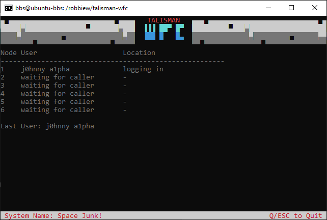

# Talisman Waiting For Caller


## What it is
Console application for Talisman BBS that displays current node activity and last caller. Just needs the path to your Talisman BBS directory, it'll read talisman.ini, find your max nodes and `talisman.log`. It continually reads (tails) the log and updates node status and displays the last caller. Requires a UTF-8 capable terminal 

## Using
Clone this repo. Switch to the cloned dir and:
- ```go get .```
- ```go build .```
- ```./talisman-wfc --path <path to talisman dir>```
- Copy `wfc.ans` to Talisman's gfiles directory, or create your own art (e.g. 80 cols 4 rows)

## Notes
- Tested on Ubuntu 24.04
- set console size to 80x25 for best results
- ANSI is converted to UTF-8

## TO-DO
- [ ] Only read 2 days of log entries upon starting (log files can get huge)
- [ ] Today's Calls count
- [ ] Today's Message Posted count
- [ ] Today's File Up/Down count
- [ ] Today's Doors opened count
- [ ] Event Log (Upcoming events from events.toml)
- [ ] Other logs: Postie, Binki
- [ ] Local Logon (launch ub UTF-8 m9ode)
