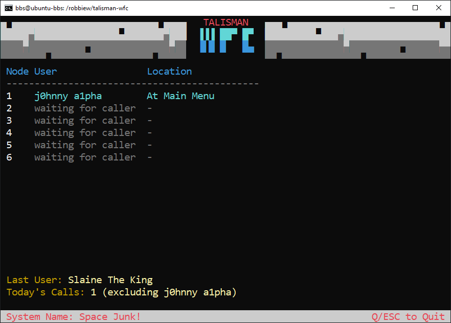

# Talisman Waiting For Caller


## What it is
Console application for [Talisman BBS](http://talismanbbs.org) that displays current node activity and last caller. Just needs the path to your Talisman BBS directory, it'll read talisman.ini, find your max nodes and `talisman.log`. It continually reads (tails) the log and updates node status and displays the last caller. Requires a UTF-8 capable terminal 

## Using
Clone this repo. Switch to the cloned dir and:
- ```go get .```
- ```go build .```
- ```./talisman-wfc --path <path to talisman dir>```
- Copy `wfc.ans` to Talisman's gfiles directory, or create your own art (e.g. 80 cols 4 rows)

## Notes
- Tested on Ubuntu 24.04
- set console size to 80x25 for best results
- `wfc.ans` (CP437) is converted to UTF-8 automatically
- Entire log file is loaded, but only the last `maxLogLines` are processed - recommend daily log rolling. Ensure the `maxLogLines` parameter is appropriately set so it covers enough of the log to capture recent user activity.

## Talisman Gitlab tickets
I've got a couple issues filed with the maintainer that could imprrove this WFC app:
- [Write user connection details to talisman.log](https://gitlab.com/lawrencestockman/talisman/-/issues/5)
- ["PREVMENU" command is not writing to talisman.log](https://gitlab.com/lawrencestockman/talisman/-/issues/4)

## TO-DO
- [X] Only read max last X log entries upon starting (log files can get huge). Or use daily log roller
- [X] Today's Calls count, exlude Sysop
- [ ] Allow variables to be set externally (e.g. a config.ini)
- [ ] Today's Messages Posted count
- [ ] Today's File Up/Down count
- [ ] Today's Doors opened count
